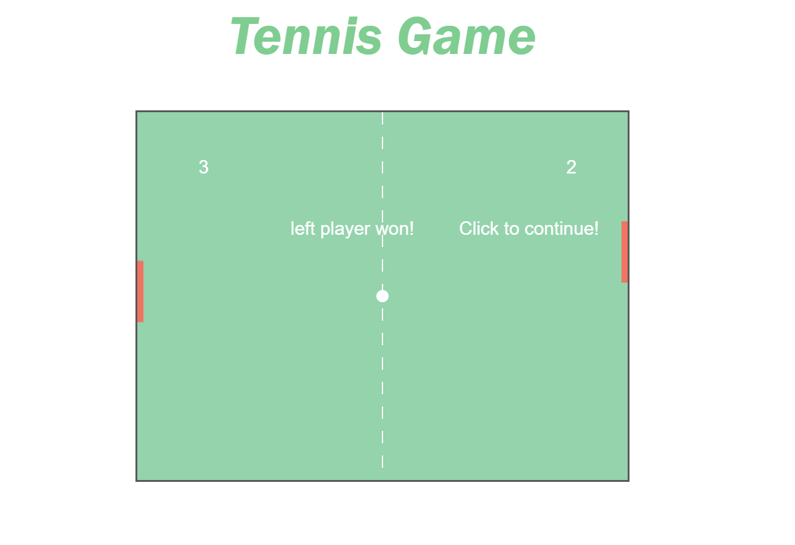

Run Game :tennis:
=================
1. clone repo
2. right `click` on html file to open with Live Server (assuming you are using vscode)
3. if you are not using vscode, open the html file to run locally

Libraries
==============
1. Bootstrap
2. font awesome
3. No packages (vanilla js :icecream: )

Output
==============

